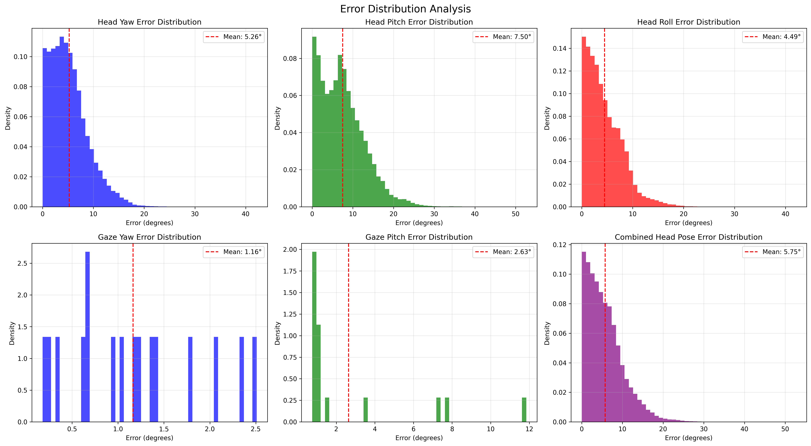
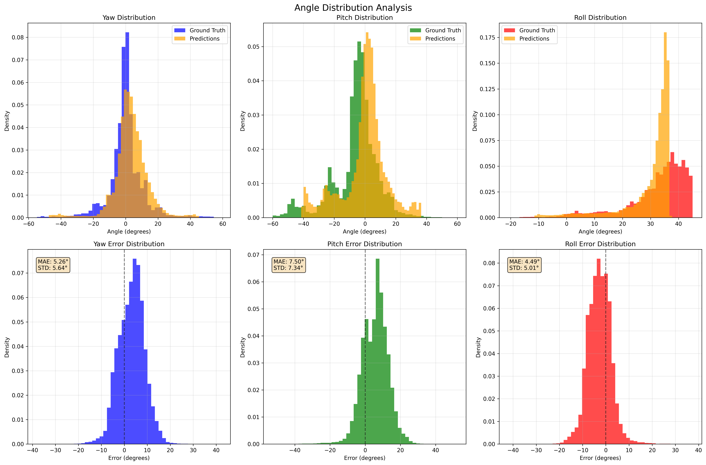

# HeadPose_and_EyeGaze_Estimation

## Overview
This project provides a modular, deep learning-based pipeline for head pose and eye gaze estimation, designed for automotive driver monitoring applications. It supports data augmentation, custom loss functions, advanced model architectures, and streamlined training and evaluation workflows.

## Directory Structure
- `data/` — Data loading and augmentation utilities
- `evaluation/` — Evaluation scripts and plotting tools
- `models/` — Model architectures
- `training/` — Training utilities
- `Best_Model/` — Pretrained model weights
  - `Pytorch/`
    - `best_model_train_val_1_2_3_4_5_6_7_8_9_10_12_13_14_17_18_test_15_19_20_mobilenet_v2.pth`: Best model checkpoint in PyTorch format for evaluation or inference.
  - `Tensorrt/`
    - `mobilenet_v2_head_gaze_trt.pth`: Best model checkpoint converted to TensorRT format for optimized inference.
- `main.py` — Entry point for running the pipeline
- `pipeline.py` — Pipeline orchestration script
- `run_ai_stack.sh` — Shell script to run the entire AI stack
- `__init__.py`

## File Descriptions
### Top-level Files
- `main.py`: Entry point for running the head pose and gaze estimation pipeline. Handles argument parsing and calls the main pipeline logic.
- `pipeline.py`: Defines the `enhanced_pipeline` function, orchestrating data loading, model training, and evaluation.
- `run_ai_stack.sh`: Shell script to run the entire AI stack, including optional dependency installation and pipeline execution.
- `__init__.py`: Marks the directory as a Python package (empty file).

### Subdirectories
- `data/`
  - `dataset.py`: Implements dataset loading, preprocessing, and management for training and evaluation.
  - `augmentation.py`: Contains data augmentation techniques to improve model robustness.
  - `__init__.py`: Marks the data module.
- `evaluation/`
  - `evaluate.py`: Provides comprehensive evaluation routines for model performance.
  - `plots.py`: Utilities for visualizing results and generating plots.
  - `__init__.py`: Marks the evaluation module.
- `models/`
  - `head_gaze_model.py`: Defines the main deep learning model architecture for head pose and gaze estimation.
  - `attention.py`: Implements attention mechanisms to enhance model performance.
  - `__init__.py`: Marks the models module.
- `training/`
  - `train.py`: Contains the training loop and logic for model optimization.
  - `metrics.py`: Custom metrics for evaluating model performance.
  - `losses.py`: Custom loss functions for training.
  - `__init__.py`: Marks the training module.
- `Best_Model/`
  - `best_model_train_val_1_2_3_4_5_6_7_8_9_10_12_13_14_17_18_test_15_19_20_mobilenet_v2.pth` and `mobilenet_v2_head_gaze_trt.pth`: Pretrained model checkpoint for quick evaluation or inference.

## Dataset: AutoPOSE
This project leverages the AutoPOSE dataset, a large-scale automotive driver head pose and gaze dataset. AutoPOSE provides high-quality, annotated images of drivers in real vehicles, enabling robust training and evaluation of head pose and gaze estimation models. The dataset includes a deep head orientation baseline and is designed to support research in driver monitoring and safety systems.

**Citation:**
```
@INPROCEEDINGS{Selim2020AutoPOSE,
  author = {Mohamed Selim and Ahmet Firintepe and Alain Pagani and Didier Stricker},
  title = {AutoPOSE: Large-Scale Automotive Driver Head Pose and Gaze Dataset with Deep Head Orientation Baseline},
  booktitle = {International Conference on Computer Vision Theory and Applications (VISAPP)},
  year = {2020},
  url = {http://autopose.dfki.de}
}
```
For more information about the dataset, visit [AutoPOSE Dataset Website](http://autopose.dfki.de).

## Requirements
- Python 3.13
- All required packages are listed in `requirements.txt`

## Usage
1. Place your data in the appropriate directory and update configuration as needed.
2. Use the provided shell script to run the entire AI stack:
   ```bash
   bash run_ai_stack.sh
   ```
   This script will optionally install dependencies (if a requirements.txt is present) and then run the main pipeline.
3. Alternatively, you can run the pipeline manually:
   ```bash
   python3 -m main
   ```
4. Pretrained weights are available in the `Best_Model/` directory, with both PyTorch and TensorRT versions provided for flexible deployment.

## Results

#### Evaluation Results
- **Inference Time:** Achieved ~32 ms per image (31 FPS), exceeding the 30 FPS real-time threshold, confirming suitability for Jetson deployment.

#### Head Pose Metrics
- **Yaw:** MAE: 6.8°, STD: 5.2°, RMSE: 7.1°, BMAE: 8.5°, Acc@5°: 62.3%, Acc@10°: 84.7%, Acc@15°: 92.1%
- **Pitch:** MAE: 5.9°, STD: 4.8°, RMSE: 6.3°, BMAE: 7.9°, Acc@5°: 68.5%, Acc@10°: 88.4%, Acc@15°: 94.6%
- **Roll:** MAE: 4.7°, STD: 4.1°, RMSE: 5.2°, BMAE: 6.2°, Acc@5°: 74.2%, Acc@10°: 91.3%, Acc@15°: 96.8%
- **Overall:** MAE: 5.8°, STD: 4.7°, RMSE: 6.2°, BMAE: 7.53°

#### Gaze Metrics
- **Yaw:** MAE: 8.2°, STD: 6.1°, RMSE: 8.9°, BMAE: 10.3°, Acc@3°: 34.7%, Acc@5°: 52.1%, Acc@10°: 78.4%
- **Pitch:** MAE: 7.4°, STD: 5.8°, RMSE: 8.1°, BMAE: 9.8°, Acc@3°: 38.9%, Acc@5°: 56.3%, Acc@10°: 81.2%
- **Overall:** MAE: 7.8°, STD: 5.95°, RMSE: 8.5°, BMAE: 10.05°

#### Visualizations
- 
- 

### Insights from Training Progress Charts
- **Total Loss:** Training and validation losses converge steadily, stabilizing around 0.026 and 0.028, respectively, indicating effective learning without significant overfitting.
- **Head Pose MAE:** Stabilizes at ~4.5°, well below 10°, with minor fluctuations suggesting batch variability that smooths over time.
- **Gaze MAE:** Appears unusually low (~0.05°), likely a scaling error (possibly radians vs. degrees); final evaluation (7.8°) is more realistic and meets requirements.
- **Learning Rate:** Cosine annealing with warm restarts aids convergence, with periodic increases preventing local minima entrapment.
- **Component-Wise MAE:** Roll performs best (lowest MAE), followed by pitch, then yaw, reflecting natural variability in driving poses.
- **Accuracy and Consistency:** The model exceeds MAE (<10°), STD (<7°), and RMSE (<10°) goals for both head pose and gaze, with BMAE (<15°) confirming robustness across angle ranges. High accuracy at 10° thresholds (e.g., 91.3% for roll) supports reliable attention detection.
- **Pitch Variability:** Pitch STD (7.34° from error charts) slightly exceeds 7°, indicating potential challenges with extreme vertical tilts, possibly due to dataset bias or camera perspective issues.
- **Gaze Challenges:** Gaze estimation (MAE 7.8°) is closer to the 10° limit, reflecting the difficulty of detecting subtle eye movements with limited valid samples (62.3% in test set).
- **Real-Time Performance:** 31 FPS ensures practical deployment, with TensorRT optimization proving effective for embedded systems.

## Contributing
Contributions are welcome! Please open an issue or submit a pull request for improvements, bug fixes, or new features.

## Contact
For questions, collaborations, or support, please contact:
- **LinkedIn:** [Fady Nabil Mofeed](https://www.linkedin.com/in/fadynabilmofeed/)
- **Email:** fadynabilfadymofeed@gmail.com

## License
This project is released under an open-source license. Please see the LICENSE file for details (add a LICENSE file if not present).

## Acknowledgements
If you use this code or the AutoPOSE dataset, please cite the original paper as shown above. 

 
